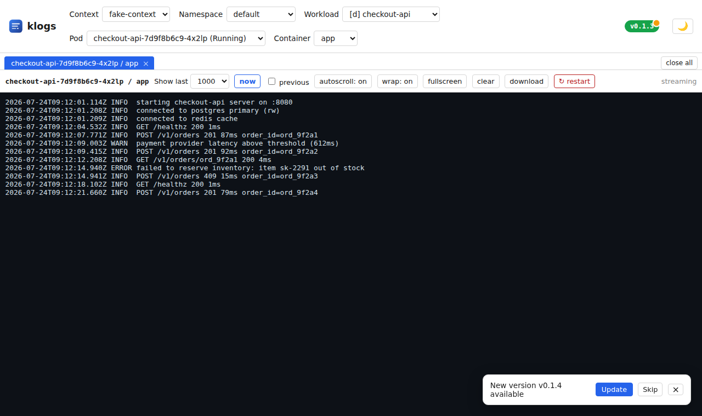

# klogs

A tiny, single-binary web app for browsing Kubernetes Deployments/Services
and tailing or downloading their pod logs — using your existing kubeconfig.



See [design.md](design.md) for the full spec.

## Install

macOS, Linux, or Windows via Git Bash/WSL:

```sh
curl -fsSL https://raw.githubusercontent.com/bkrajendra/klogs/main/install.sh | bash
```

Windows (PowerShell):

```powershell
irm https://raw.githubusercontent.com/bkrajendra/klogs/main/install.ps1 | iex
```

Either script downloads the release archive matching your OS/arch, verifies
it against the release's `checksums.txt`, and installs the `klogs` binary
into a directory on your `PATH`:

- `install.sh`: `/usr/local/bin` if writable, else `~/.local/bin`
  (override with `KLOGS_INSTALL_DIR`).
- `install.ps1`: `%LOCALAPPDATA%\Programs\klogs`, added to your user `PATH`
  automatically (override with `KLOGS_INSTALL_DIR`).

Verify it worked from any new terminal:

```sh
klogs --version
klogs --open
```

`--open` starts the server and launches the web UI in your default browser;
without it, klogs still prints the local URL to open once it's listening.

## Update

Three ways, all equivalent:

- **From the web UI** — the version badge next to the theme toggle turns
  into an update indicator when a newer release is out (checked 5s after
  load, then every 30 min); click it, "Update now", then "Restart now"
  once it's done. A floating notification also appears the first time an
  update is found each session.
- **`klogs update`** — downloads, verifies, and installs the latest release
  in place, no browser needed:
  ```sh
  klogs update              # latest
  klogs update --version v0.1.1   # pin a specific version
  ```
  Restart klogs yourself afterward to use it.
- **Re-run the install command** — always installs the latest release:
  ```sh
  curl -fsSL https://raw.githubusercontent.com/bkrajendra/klogs/main/install.sh | bash
  # or, to pin a version:
  KLOGS_VERSION=v0.1.1 curl -fsSL https://raw.githubusercontent.com/bkrajendra/klogs/main/install.sh | bash
  ```
  (`$env:KLOGS_VERSION = "v0.1.1"` before the `irm | iex` line on Windows.)

## Flags

```
--port int          port to serve the web UI on (default 8080)
--addr string        address to bind to (default "127.0.0.1")
--kubeconfig string  path to kubeconfig (default: $KUBECONFIG or ~/.kube/config)
--open               open the web UI in the default browser once the server starts
--version            print version and exit

klogs update [--version vX.Y.Z]   # download, verify, and install a release in place
```

## Features

- Splash screen on load with the version, an update-available indicator,
  keyboard shortcuts, and a "Get started" dismiss (or just press any
  key/click outside/wait a few seconds) — click the header logo any time
  to bring it back.
- In-app updates: a green version badge (next to the theme toggle) flags
  when a newer release is out; click it to download, verify, and install
  in place, then restart with one more click. Skipping only silences it
  for the rest of that session — the badge keeps tracking it either way.
- Top filter bar: context → namespace → workload (`[d]`eployment/`[s]`ervice)
  → pod → container. Picking a pod (or container, for multi-container pods)
  opens its logs immediately — no extra click needed. Context and
  namespace are remembered across restarts (`localStorage`).
- Tabs start at the tail of the log (last 1000 lines by default, not the
  whole history) and stream forward from there; scroll up any time to read
  further back. **Show last** (100/1000/2000/4000/All) controls both how
  far back a (re)connect starts and how many lines stay buffered in the
  browser during a long-running session; **now** jumps to the current
  moment, skipping history entirely (like `--tail=0`). None of this
  affects **download** — it always fetches the complete log fresh from the
  server.
- Multi-tab live log streaming (WebSocket) with autoscroll (auto-pauses if
  you scroll up, resumes at the bottom), word-wrap, and full-screen
  toggles — each with a keyboard shortcut (`a`/`w`/`f`) while a tab is
  active. Close a single tab from its own × or clear the whole strip with
  "close all".
- A "previous container" toggle for crash-looping pods.
- Restart the Deployment (or the Deployment behind a Service) a tab's pod
  belongs to, right from that tab's toolbar (`r` shortcut), with a
  confirmation prompt first. Once the old pod is replaced, klogs picks up
  the new one automatically and opens a tab for it.
- Light/dark theme toggle, persisted locally.

## Build from source

```sh
go run ./cmd/klogs      # run directly
go build -o klogs ./cmd/klogs   # or build a binary
```

## Releases

Every push to `main` automatically cuts a new release: the workflow bumps
the patch version from the latest `vX.Y.Z` tag (starting at `v0.1.0`),
pushes the new tag, and runs GoReleaser to build linux/darwin/windows
amd64/arm64 binaries and attach them to a GitHub Release.

- Put `[minor]` or `[major]` in a commit message to bump that field
  instead of patch.
- Put `[skip release]` in a commit message to skip releasing for that
  push.
- Pushing a `vX.Y.Z` tag yourself releases exactly that tag, no bump.

See `.github/workflows/release.yml` and `.goreleaser.yaml`.
